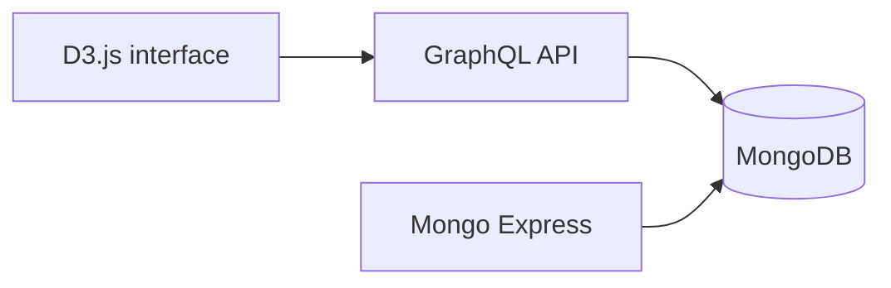

# Interactive Sales Data Visualization with Docker

Containerized web application for exploring sales data through interactive charts and geographic visualizations.

The application combines a MongoDB database, a GraphQL API developed with Node.js, a D3.js front end, and Mongo Express. Docker Compose orchestrates the complete environment.

## Architecture



## Technologies

Docker · Docker Compose · Node.js · GraphQL · MongoDB · Mongo Express · D3.js · JavaScript · HTML/CSS

## Services

| Service | URL | Purpose |
| --- | --- | --- |
| Web interface | `http://localhost` | Interactive charts and maps |
| GraphQL API | `http://localhost:4000` | Query layer for sales data |
| Mongo Express | `http://localhost:8081` | Local database administration |

## Run locally

### Requirements

- Docker
- Docker Compose

### 1. Clone the repository

```bash
git clone https://github.com/elymeraj/Data-Visualization-Application-with-Docker.git
cd Data-Visualization-Application-with-Docker
```

### 2. Build and start the services

```bash
docker compose -f stack.yml up -d --build
```

If your installation uses the legacy command, replace `docker compose` with `docker-compose`.

### 3. Import the sample sales data

```bash
docker exec -i mongo-dev sh -c \
  'mongoimport -d bda -c sales --authenticationDatabase admin -u root -p example' \
  < ui/data/sales.bson
```

The Mongo Express credentials in `stack.yml` are intended for local development only:

- Username: `root`
- Password: `example`

## Project structure

```text
graphql/                Node.js GraphQL API, schema, and resolvers
ui/                     D3.js interface, styles, scripts, and datasets
stack.yml               Docker Compose service definition
tp8.md                  Additional project documentation
```

## Container management

```bash
# Start existing containers
docker compose -f stack.yml up -d

# Rebuild and start
docker compose -f stack.yml up -d --build

# Stop and remove the containers
docker compose -f stack.yml down
```

## Authors

- Eldis Ymeraj
- Redwan Omari

Developed as part of the Master's degree in Artificial Intelligence at the University of Caen Normandy.
